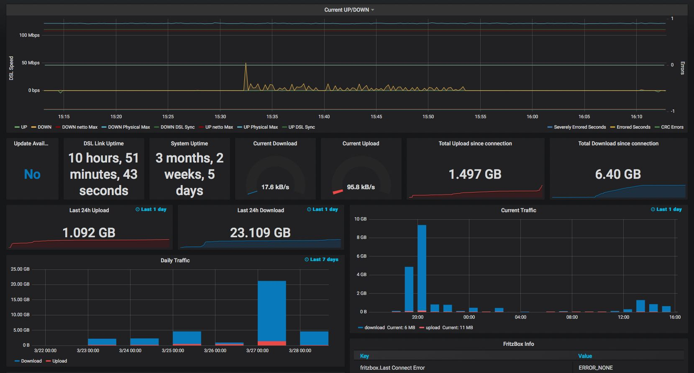

# Fritz InfluxDb

Fritz InfluxDb is a tiny daemon written in python to fetch data from a fritz box router and writes it to influxdb.
It is equal capable as fritzcollectd and directly writing to influxdb.

# Requirements
* python3.6 or newer
* influxdb
* fritzconnection >= 1.3.3

## Python 2.7
If you still need to run it with Python 2 check out the the branch
[python2.7](https://github.com/yunity/fritzinfluxdb/tree/python2.7)

# Setup
* here we assume we install in ```/opt```

## Ubuntu 18.04
```
sudo apt-get install virtualenv python3-lxml
cd /opt
git clone https://github.com/yunity/fritzinfluxdb.git
cd fritzinfluxdb
virtualenv --system-site-packages -p python3 .venv
. .venv/bin/activate
pip3 install -r requirements.txt
```

## RHEL/CentOS 7 with EPEL
```
yum install git python36-virtualenv python36-lxml
cd /opt
git clone https://github.com/yunity/fritzinfluxdb.git
cd fritzinfluxdb
virtualenv-3 --system-site-packages .venv
. .venv/bin/activate
pip3 install -r requirements.txt
```

* modify your configuration and test it
```
./fritzinfluxdb.py
```

## Install as systemd service
Ubuntu
```
cp /opt/fritzinfluxdb/fritzinfluxdb.service /etc/systemd/system
```
RHEL/CentOS
```
sed -e 's/nogroup/nobody/g' /opt/fritzinfluxdb/fritzinfluxdb.service > /etc/systemd/system/fritzinfluxdb.service
```

```
systemctl daemon-reload
systemctl start fritzinfluxdb
systemctl enable fritzinfluxdb
```

## Run with Docker
```
git clone <this_repo_url>
cd fritzinfluxdb
docker build -t fritzinfluxdb .
```

Copy the config from the [example](default.ini) to ```my-fritzinfluxdb.ini``` and edit
the settings.

Now you should be able to run the image with following command
```
docker run -d -v /PATH/TO/my-fritzinfluxdb.ini:/app/fritzinfluxdb.ini --name fritzinfluxdb fritzinfluxdb
```

If you're running the influxdb in a docker on the same host you need to add `--link` to the run command.

### Example:
* starting the influx container
```
docker run --name=influxdb -d -p 8086:8086 influxdb
```
* set influxdb host in `fritzinfluxdb.ini` to `influxdb`
* run docker container
```
docker run --link influxdb -d -v /PATH/TO/my-fritzinfluxdb.ini:/app/fritzinfluxdb.ini --name fritzinfluxdb fritzinfluxdb
```

## Upgrading
If you upgrade from a version < 0.3 make sure to perform following steps

* update your virtual env `pip3 install -r requirements.txt`
* use the updated config and add the credentials and addresses from your old config

# Grafana

Use ```grafana_dashboard_fritzbox.json``` to import this dashboard.
This was heavily inspired from: https://grafana.com/dashboards/713



# Configure more attributes

check here to find a overview of more attributes which probaly could be added
https://wiki.fhem.de/w/index.php?title=FRITZBOX

# License
>You can check out the full license [here](LICENSE.txt)

This project is licensed under the terms of the **MIT** license.
